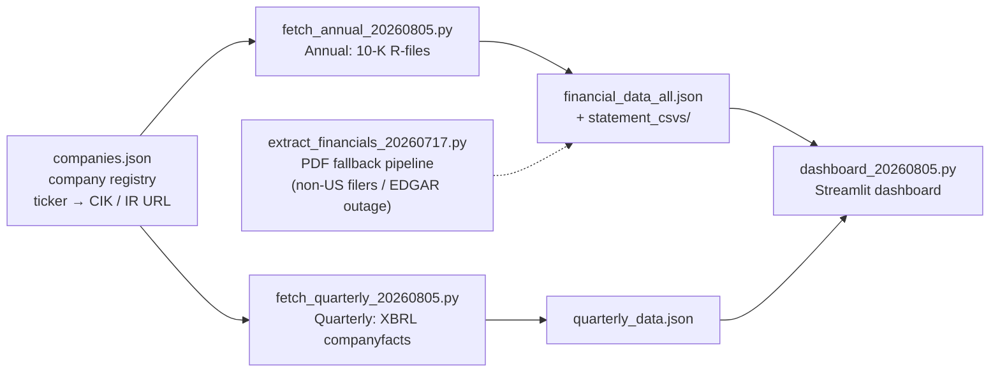
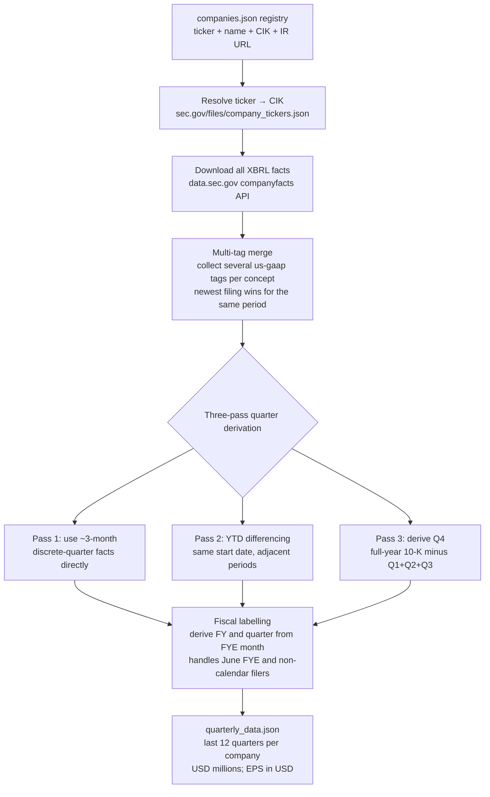
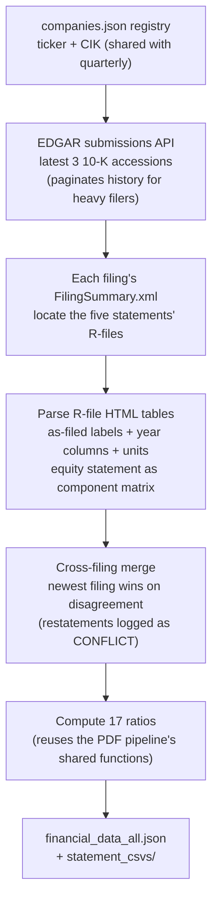

# 📊 Multi-Company Financial Dashboard

**English** | [繁體中文](README.zh-TW.md)

Automatically pulls annual (10-K) and quarterly (10-Q) financial statements
for listed companies from **SEC EDGAR**, merges them into structured data, and
presents them in an interactive **Streamlit** dashboard: 17 financial ratios,
plain-language formula explanations, common-size analysis, and cross-company
comparison. Give it a stock ticker and it pulls that company's complete
financial picture.

Currently included: **GOOG (Alphabet), AMZN (Amazon), META (Meta Platforms),
MSFT (Microsoft), ORCL (Oracle), PLTR (Palantir)** — adding a company takes a
single command.

> ⚠️ This project is for educational and technical demonstration purposes only.
> All data comes from public SEC filings and **does not constitute investment
> advice**.

---

## 📷 Screenshots

**Single-company annual view** — key metric cards, revenue/net-income bar
chart, and debt-ratio gauge. The sidebar links straight to the company's IR
page and to each 10-K's original EDGAR filing:


**Cross-company comparison** — compare any metric side by side; companies whose
fiscal year doesn't end in December are flagged automatically:


**Ratio formula reference** — pick any ratio to see its formula and a
plain-language explanation:


**Raw statements with common-size columns** — every line item shows its
percentage of revenue (or of total assets) right next to the value:


---

## ✨ Features

- **Add a company with one command** — register it with a ticker and an
  investor-relations (IR) URL, and both annual and quarterly statements
  download automatically from SEC EDGAR. No hunting for PDFs, no scraping
  IR pages that every company formats differently.
- **Annual / quarterly dual views** — switch between 10-K annual data (last
  ~5 fiscal years) and 10-Q quarterly data (last 12 quarters) from the
  sidebar; each supports both single-company deep dives and multi-company
  side-by-side comparison.
- **Key metric cards** — Net Profit Margin, Current Ratio, Debt Ratio, ROE,
  and Free Cash Flow up front, each with its year-over-year (or
  quarter-over-quarter) change.
- **Interactive charts** — revenue and net-income bars, a debt-ratio gauge,
  multi-company comparison bars, and quarterly gross/operating/net margin
  trend lines. All zoomable and downloadable as PNG.
- **17 financial ratios + custom ratios** — covering profitability,
  liquidity, leverage, efficiency, and cash flow. You can also build your own
  ratio by picking any numerator and denominator from the extracted line
  items and saving it.
- **Plain-language formula explanations** — pick any ratio to see its LaTeX
  formula plus a one-sentence explanation of what it means.
- **All five statements + line-item proportions** — balance sheet, income
  statement, comprehensive income, stockholders' equity, and cash flow are all
  browsable. Income-statement lines show "% of revenue" and balance-sheet
  lines show "% of total assets" (common-size analysis).
- **Unit captions** — every table and chart states its unit right under the
  title (USD millions; per-share figures in USD), so numbers can't be misread.

---

## 🧱 Tech Stack

| Category | Choice |
|---|---|
| Language | Python 3.11 |
| Visualization | [Streamlit](https://streamlit.io/) + [Plotly](https://plotly.com/python/) |
| Data processing | [pandas](https://pandas.pydata.org/) |
| Data source | [SEC EDGAR](https://www.sec.gov/edgar) — R-file HTML tables (annual) + XBRL companyfacts API (quarterly) |
| PDF fallback parsing | [pdfplumber](https://github.com/jsvine/pdfplumber) (text-layer extraction; OCR is a dormant fallback, only needed for scanned pages) |

> An earlier version evaluated `tabula-py`, but 10-K/10-Q statement pages have
> no table gridlines, so tabula's table detection found nothing at all. Hence
> the switch to line-by-line text parsing with pdfplumber.

---

## 🏗️ Architecture Overview



The annual and quarterly fetchers share one company registry, update
independently, and feed the same dashboard. The PDF extractor is a fallback
path that you normally never need to run.

---

## 🚀 Quick Start

### 1. Set up the environment

```bash
conda create -n finan python=3.11
conda activate finan
pip install -r requirements.txt
```

### 2. Set your SEC contact email

SEC EDGAR requires every API request to carry a contact email in its
User-Agent header. Set this environment variable before running any fetch
command (without it a placeholder is used and SEC may reject the request):

```bash
# macOS / Linux
export SEC_CONTACT_EMAIL="you@example.com"

# Windows PowerShell
$env:SEC_CONTACT_EMAIL = "you@example.com"
```

### 3. Fetch data and launch the dashboard

```bash
python fetch_annual_20260805.py fetch      # annual data (all registered companies)
python fetch_quarterly_20260805.py fetch   # quarterly data (all registered companies)
streamlit run dashboard_20260805.py -- --data financial_data_all.json
```

Your browser opens at `http://localhost:8501`.

---

## 📖 Usage

### Adding and managing companies

Both fetchers share one registry, so adding a company once makes it available
to both:

```bash
python fetch_annual_20260805.py add AAPL https://investor.apple.com/investor-relations/
python fetch_annual_20260805.py fetch AAPL
python fetch_quarterly_20260805.py fetch AAPL
```

```bash
python fetch_quarterly_20260805.py list      # list registered companies
python fetch_quarterly_20260805.py remove AAPL
```

You can also use the "➕ Add a company" form in the dashboard sidebar: enter a
ticker and IR URL and it registers plus downloads both annual and quarterly
data in one click.

### Updating existing companies

```bash
python fetch_annual_20260805.py fetch                   # all companies, latest 3 10-Ks (~5 fiscal years)
python fetch_annual_20260805.py fetch MSFT --filings 6  # extend history (~8-10 fiscal years)
python fetch_quarterly_20260805.py fetch --quarters 8   # all companies, custom quarter count (default 12)
```

Or just press "🔄 Refresh all EDGAR data" in the dashboard sidebar.

### PDF fallback pipeline (non-US filers, or during an EDGAR outage)

```bash
python extract_financials_20260717.py input_pdf_file financial_data_all.json statement_csvs
```

Drop `TICKER-10-K-YYYY.pdf` files into `input_pdf_file/` and run the command;
it parses all five statements and outputs JSON in the same schema as the EDGAR
path. Successfully parsed PDFs are moved to `parsed_pdf_file/`. If the folder
contains no parsable 10-K, the command refuses to overwrite the existing output.

---

## 📁 Repository Structure

```
.
├── fetch_annual_20260805.py       # Annual fetcher (SEC EDGAR 10-K R-files)
├── fetch_quarterly_20260805.py    # Quarterly fetcher (SEC EDGAR XBRL companyfacts API)
├── dashboard_20260805.py          # Streamlit dashboard
├── extract_financials_20260717.py # PDF annual extractor (fallback pipeline + shared library)
├── companies.json                 # Company registry: ticker → name / CIK / IR URL
├── custom_ratios.json             # User-defined ratios
├── financial_data_all.json        # Annual output (sample data, frozen at generation date)
├── quarterly_data.json            # Quarterly output (sample data, frozen at generation date)
├── requirements.txt               # Python dependencies
├── screenshots/                   # Dashboard screenshots used in this README
└── statement_csvs/
    └── <TICKER>/                  # Five financial statements per company, as CSV
        ├── Consolidated_Balance_Sheets.csv
        ├── Consolidated_Statements_of_Income.csv
        ├── Consolidated_Statements_of_Comprehensive_Income.csv
        ├── Consolidated_Statements_of_Stockholders_Equity.csv
        └── Consolidated_Statements_of_Cash_Flows.csv
```

> `financial_data_all.json`, `quarterly_data.json`, and `statement_csvs/` are
> sample outputs so you can clone the repo and launch the dashboard on real
> data immediately, without running a fetch first. That data is frozen at its
> generation date — run the fetch commands above to refresh it.
>
> The PDF fallback pipeline uses two local working folders,
> `input_pdf_file/` (inbox for PDFs to parse) and `parsed_pdf_file/` (already
> parsed). They aren't tracked in this repository.

---

## ⚙️ How It Works

### Quarterly fetcher — `fetch_quarterly_20260805.py`



Notes:

- **Multi-tag merge** — companies use different XBRL tags for the same
  concept, and **a single company also switches tags over time** (one
  company's revenue tag changed between fiscal years). So each concept lists
  several candidate tags; all are collected and merged, with the newest filing
  winning for any given period.
- **Derived fields** — Gross Profit is computed as revenue minus cost of
  revenue when untagged; companies with no Total Liabilities line get it from
  total assets minus stockholders' equity; Free Cash Flow = operating cash
  flow minus capital expenditures.
- **Quarterly ratios** — each quarter gets Gross/Operating/Net Margin,
  Current Ratio, Debt Ratio, FCF, and FCF Margin.

### Annual fetcher — `fetch_annual_20260805.py`



Notes:

- **R-files** are the data behind SEC's own "Financial Report" viewer — every
  10-K filing ships a `FilingSummary.xml` indexing an HTML table file for each
  statement. Far more reliable than parsing PDF layout, and it preserves the
  original line-item order and unit declarations.
- **The equity statement becomes a structured matrix** — unlike the PDF
  pipeline, which could only store raw text lines, R-files reconstruct it
  fully into "Line Item" plus component columns (Total / stock + paid-in
  capital / AOCI / retained earnings).
- **Cross-filing merge** — same rule as the quarterly path: when a fiscal
  year's figure differs between filings (restatement or reclassification), the
  newer filing wins and a `CONFLICT` message is printed for review.

### Dashboard — `dashboard_20260805.py`

- **Annual/quarterly toggle** — a sidebar radio selects Annual (10-K) or
  Quarterly (10-Q); each has Single Company and Compare Companies views.
- **Add-a-company form** — enter a ticker and IR URL in the sidebar and it
  calls both fetch modules: register → download EDGAR data → clear cache →
  reload.
- **Ratio formula reference** — a `RATIO_FORMULAS` dictionary holds the LaTeX
  formula and plain-language explanation for all 17 ratios, rendered with
  `st.latex`; custom ratios get a formula generated automatically. For example:

  $$
  \text{Debt Ratio} = \frac{\text{Total Liabilities}}{\text{Total Assets}}
  $$

- **Common-size columns** — a "%" column is interleaved next to every value
  column: income-statement lines are divided by revenue, balance-sheet lines
  by total assets. Per-share rows get no percentage. Quarterly tables work the
  same way.
- **Quarterly single-company view** — five metric cards for the latest quarter
  (with QoQ change), quarterly revenue/net-income bars, gross/operating/net
  margin trend lines, a quarterly ratio table, and tabs for the three main
  statements.
- **Quarterly comparison view** — pick any metric; companies are aligned by
  calendar quarter in grouped bars plus a data table, so filers with different
  fiscal year ends still compare correctly.

---

## 📌 Data Limitations & Notes

### Limitations

- Only **US-listed (SEC-filing)** companies are supported; for anything else,
  use the PDF fallback pipeline.
- **Q4 is derived** — no 10-Q is filed for Q4, so it's computed as the
  full-year 10-K figure minus Q1–Q3.
- **Cash-flow reconstruction** — 10-Q cash-flow statements are year-to-date
  cumulative, so discrete quarters are recovered by differencing adjacent YTD
  periods.
- **Quarterly EPS is approximate** — when derived by YTD differencing or
  full-year-minus-three-quarters, a changing share count makes it differ
  slightly from the as-filed number.
- **R-files exist only for filings from roughly 2010 onward** (they're an
  artifact of the XBRL era).
- R-file labels are XBRL preferred labels and occasionally differ from the
  printed PDF (for instance, some companies label revenue as singular
  "Revenue" rather than "Total revenue"). The synonym table covers the common
  variations; adding a new company may occasionally require adding one or two
  more synonyms.
- **Some ratios can't be computed for certain filers** — for example, some
  companies don't report a single aggregate "cost of revenue" line but break
  costs out by business segment. Gross Margin shows N/A for those companies.
  That faithfully reflects a difference in statement format, not a parsing
  error.
- The fiscal-year range covered by a company's latest filings shifts around
  (a company whose fiscal year isn't the calendar year will have its latest
  10-K run one year further ahead than calendar-year filers). This makes the
  oldest or newest fiscal year differ slightly between companies. It's
  expected; use `--filings` to extend the history and fill the gap.
- For heavy filers, older filings may fall outside EDGAR's "recent" list. The
  code already walks the paginated history files to handle this.

### Notes

- Runtime requirements: an internet connection, and a contact email in the
  User-Agent as SEC requires (see `SEC_CONTACT_EMAIL` in Quick Start).
- The IR URL is stored as a reference link only — the program **never scrapes
  that page**.
- **Companies whose fiscal year doesn't end 12/31** label their quarters
  differently from calendar-year filers. The comparison views align on
  **calendar quarter** so companies with different year ends can still sit
  side by side.
- **Restatement rule** — when the same period's figure differs between
  filings, the **newer filing wins**, and a `CONFLICT` message is printed
  during extraction for review. These are genuine restatements or
  reclassifications, not program errors.
- A quarter's net margin can look unusually high or low because of a one-time
  non-operating gain or loss. If such a figure reconciles against the raw XBRL
  facts (YTD totals minus prior quarters), it's the real as-filed number, not
  a parsing mistake.

---

## ✅ Verification

- **Annual data** — compared value by value against the PDF-extracted version
  across 448 data points (all raw line items plus all 17 ratios). **Fully
  identical** apart from expected differences at the filing-window boundary;
  known restatements were re-detected identically from EDGAR.
- **Quarterly data** — 15 automated checks all pass: each fiscal year's four
  quarters sum to the corresponding 10-K annual figure for revenue, net
  income, and operating cash flow (differences only ±1 from rounding);
  balance-sheet period-end values match the 10-K exactly; no missing core
  fields across 48 quarters.
- **Common-size columns** — spot-checked against hand calculations (for
  example, cash as a percentage of total assets and cost as a percentage of
  revenue for a given company-year).
- **End-to-end add-a-company test** — the add → fetch → remove flow was tested
  with several companies, including ones with non-standard fiscal calendars,
  and quarters were labelled correctly throughout.
- **Browser testing** — annual/quarterly, single/comparison views, and the
  sidebar forms were each exercised with no console or server errors.

---

## 🕰️ Project Evolution

This project was built iteratively with [Claude Code](https://claude.com/claude-code),
starting from a single company's financial-statement PDF and growing into its
current form:

1. **v1** — one company (Google), parsing all five statements from PDFs and
   computing 3 basic ratios.
2. **v2** — expanded to three companies with three years of 10-Ks each, adding
   the full set of 17 ratios and a cross-company comparison view.
3. **v3** — added quarterly data (downloaded via the SEC EDGAR XBRL API),
   unit captions, ratio formula explanations, common-size columns, and
   one-command company registration by ticker.
4. **v4** — moved annual data to SEC EDGAR as well (no more manually
   downloaded PDFs), so registering a company now populates both annual and
   quarterly data at once. The PDF pipeline was demoted to a fallback path for
   non-US filers and service outages.

Every design trade-off along the way — why pdfplumber over tabula-py, why
"newest filing wins" for restatements — came out of hitting the problem in
practice and validating against real data.

---

## 📄 License & Data Source

The **code** in this repository is released under the [MIT License](LICENSE).

That license does **not** extend to the financial data shipped in
`financial_data_all.json`, `quarterly_data.json`, and `statement_csvs/`. Those
figures are derived from public filings on [SEC EDGAR](https://www.sec.gov/edgar)
and are reported by the companies themselves — they are facts in the public
record, not original work of this project. Attribution for the underlying data
belongs to the filing companies and the SEC.

---

## 📚 References

- [SEC.gov | Search Filings](https://www.sec.gov/search-filings)
- [Understanding Capital Expenditure (CapEx): Definitions, Formulas, and Real-World Examples](https://www.investopedia.com/terms/c/capitalexpenditure.asp)
