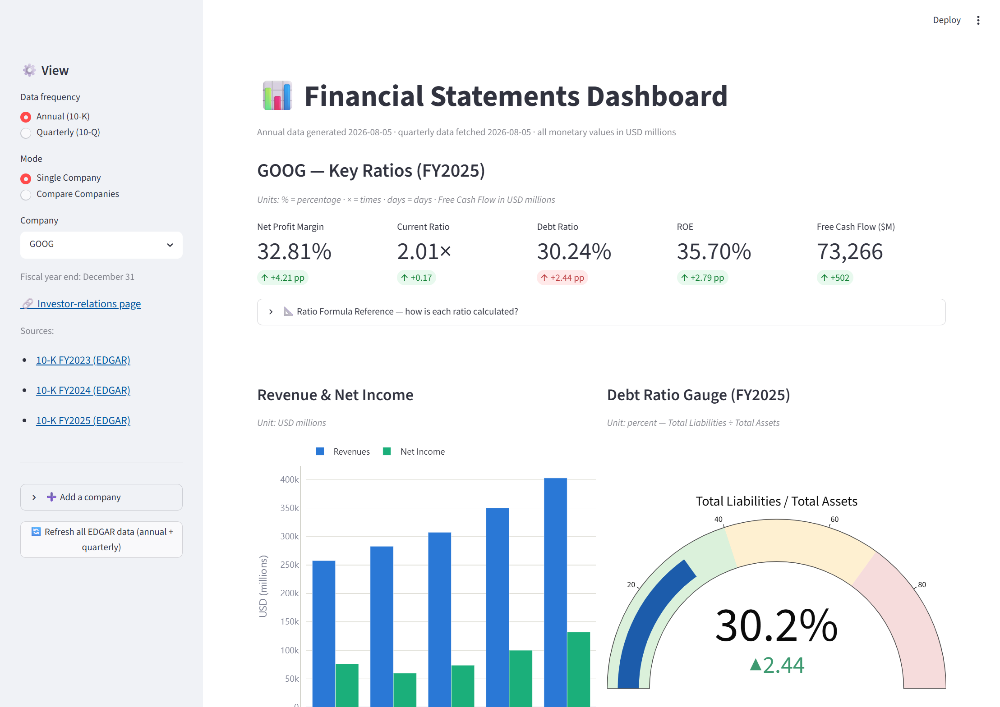
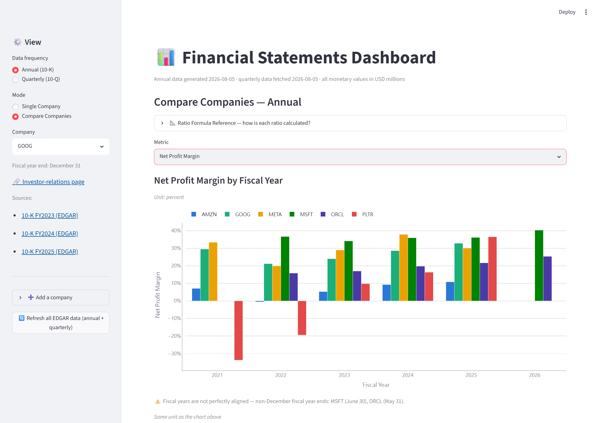
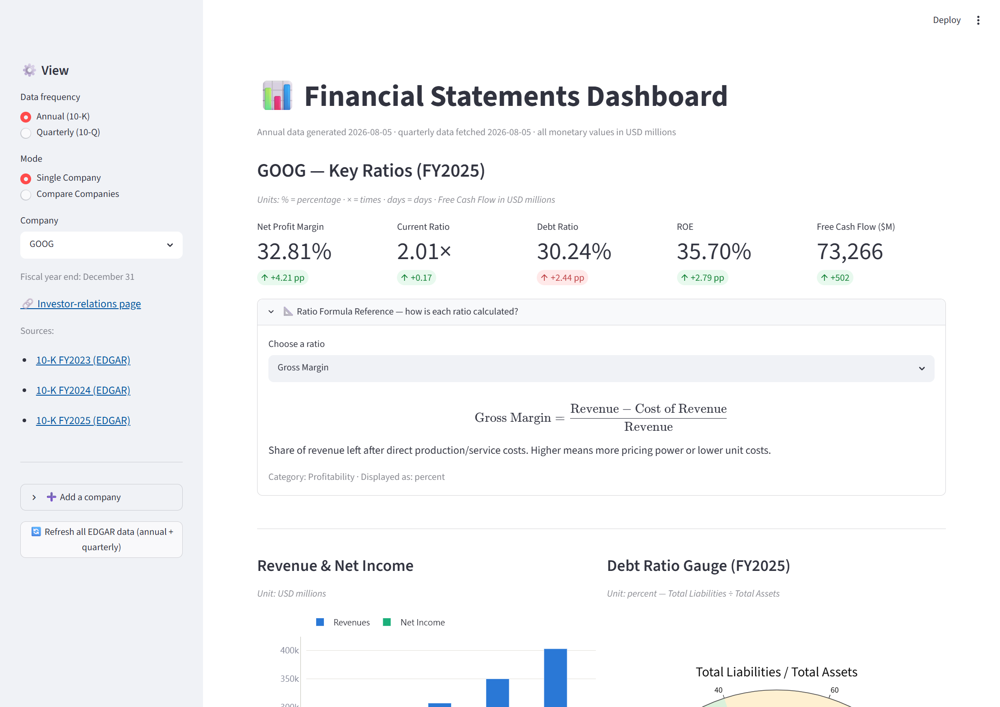
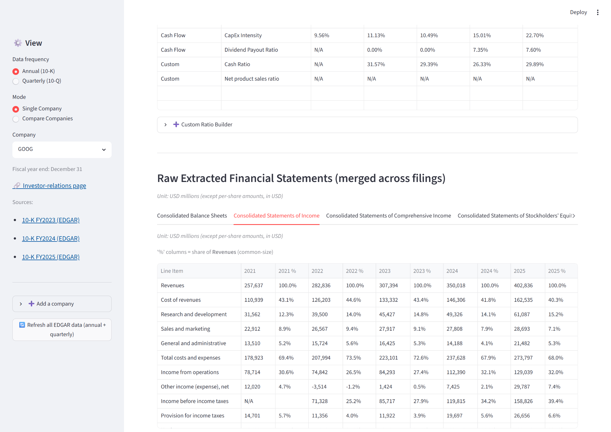
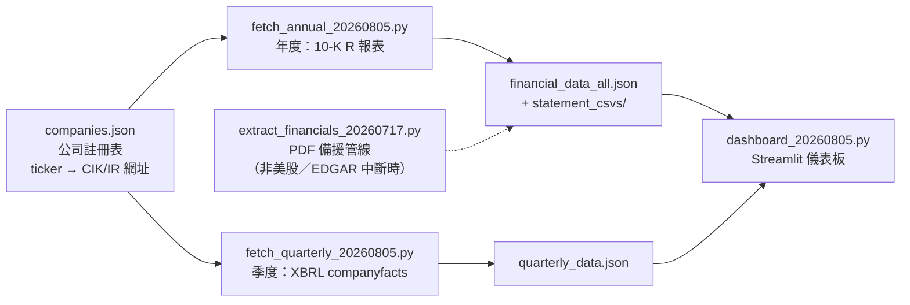
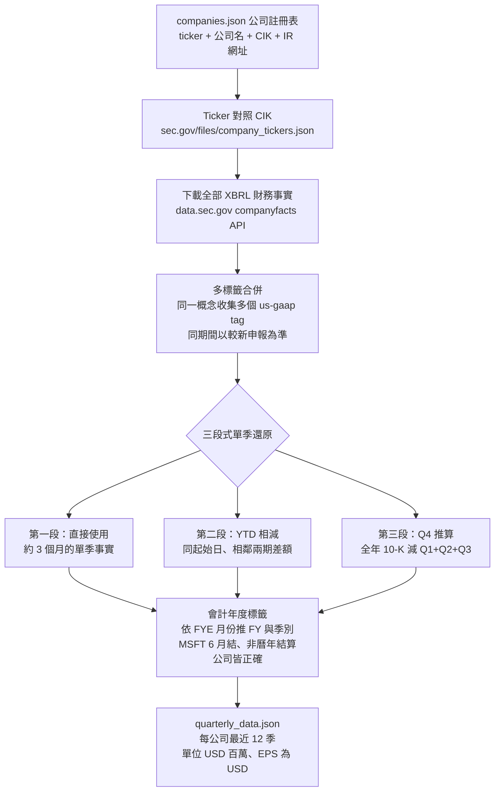
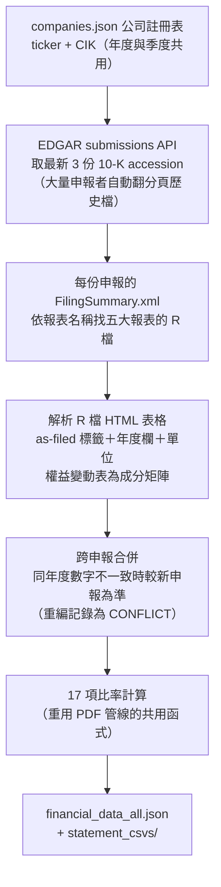

# 📊 多公司財務儀表板（Financial Dashboard）

[English](README.md) | **繁體中文**

從 **SEC EDGAR** 自動抓取上市公司的年度（10-K）與季度（10-Q）財報，
合併成結構化資料，並以 **Streamlit** 呈現互動式儀表板：17 項財務比率、
比率公式白話解釋、共同比（common-size）分析、跨公司比較。
只要給一個股票代號，就能自動把一家公司的完整財務面貌抓下來。

目前已收錄：**GOOG（Alphabet）、AMZN（Amazon）、META（Meta Platforms）、
MSFT（Microsoft）、ORCL（Oracle）、PLTR（Palantir）**，新增公司只需一個指令。

> ⚠️ 本專案僅供教育與技術展示用途，資料來自公開的 SEC 申報文件，
> **不構成任何投資建議**。

---

## 📷 截圖

**單一公司年度視圖**——關鍵指標卡、營收／淨利長條圖、負債比率量表，
側邊欄直接連到該公司的 IR 網頁與每一份 10-K 的 EDGAR 原始申報：



**跨公司比較**——任選指標並排比較，會計年度非曆年制的公司會自動標註：



**比率公式說明**——下拉選擇任一比率，顯示計算公式與白話解釋：



**原始財報＋共同比欄位**——每個科目數字旁直接顯示占營收（或占總資產）
的百分比：



---

## ✨ 功能特色

- **一鍵新增公司**：輸入股票代號（ticker）與投資人關係（IR）網址即可註冊，
  年度＋季度財報自動從 SEC EDGAR 下載——不需要手動找 PDF、不需要爬取
  各家公司格式不同的 IR 網頁。
- **年度／季度雙視圖**：側邊欄一鍵切換 10-K 年度資料（近 5 個會計年度）
  與 10-Q 季度資料（近 12 季），各自支援單一公司深入分析與多公司並排比較。
- **關鍵指標卡**：頭部即顯示淨利率（Net Profit Margin）、流動比率
  （Current Ratio）、負債比率（Debt Ratio）、股東權益報酬率（ROE）、
  自由現金流（Free Cash Flow），並附年增／季增變化。
- **互動式圖表**：營收與淨利長條圖、負債比率量表（gauge）、
  多公司比較長條圖、季度毛利率／營益率／淨利率趨勢線——全部可縮放、
  可下載為 PNG。
- **17 項財務比率＋自訂比率**：涵蓋獲利能力、流動性、槓桿、效率、現金流
  五大類；使用者也能從已擷取的科目自由組合分子／分母，儲存成自訂比率。
- **比率公式白話解釋**：下拉選擇任一比率，即顯示其 LaTeX 計算公式與
  一句話說明（例如「Debt Ratio 越高代表資產中由負債支應的比例越高」）。
- **原始五大財報＋科目占比**：資產負債表、損益表、綜合損益表、
  股東權益變動表、現金流量表原始資料皆可查閱；損益表每科目旁顯示
  「占營收 %」、資產負債表每科目旁顯示「占總資產 %」（共同比分析）。
- **單位標註**：每張表格與圖表標題下方都標明單位（USD millions；
  每股數字為 USD），避免誤讀。

---

## 🧱 技術棧

| 類別 | 選用 |
|---|---|
| 語言 | Python 3.11 |
| 資料視覺化 | [Streamlit](https://streamlit.io/) + [Plotly](https://plotly.com/python/) |
| 資料處理 | [pandas](https://pandas.pydata.org/) |
| 資料來源 | [SEC EDGAR](https://www.sec.gov/edgar) — R 報表 HTML 表格（年度）＋ XBRL companyfacts API（季度） |
| PDF 備援解析 | [pdfplumber](https://github.com/jsvine/pdfplumber)（文字層抽取；OCR 為休眠備援，僅掃描頁需要） |

> 早期版本曾評估 `tabula-py`，但 10-K/10-Q 財報頁面沒有表格格線，
> tabula 的表格偵測完全抓不到內容，因此改用 pdfplumber 逐行文字解析。

---

## 🏗️ 架構總覽



年度與季度兩支下載器共用同一份公司註冊表，資料各自獨立更新、
共同餵給同一個儀表板。PDF 擷取器是備援路徑，平時不需要執行。

---

## 🚀 Quick Start

### 1. 建立環境

```bash
conda create -n finan python=3.11
conda activate finan
pip install pandas streamlit plotly pdfplumber
```

### 2. 設定 SEC 聯絡信箱

SEC EDGAR 要求所有 API 請求的 User-Agent 附上聯絡信箱，執行任何下載
指令前請先設定環境變數（未設定時會用一個佔位符，SEC 可能會拒絕請求）：

```bash
# macOS / Linux
export SEC_CONTACT_EMAIL="you@example.com"

# Windows PowerShell
$env:SEC_CONTACT_EMAIL = "you@example.com"
```

### 3. 下載資料並啟動儀表板

```bash
python fetch_annual_20260805.py fetch      # 年度資料（全部已註冊公司）
python fetch_quarterly_20260805.py fetch   # 季度資料（全部已註冊公司）
streamlit run dashboard_20260805.py -- --data financial_data_all.json
```

瀏覽器會自動開啟 `http://localhost:8501`。

---

## 📖 使用方式

### 新增／管理公司

年度與季度下載器共用同一份註冊表，新增一次即可讓兩者都抓到資料：

```bash
python fetch_annual_20260805.py add AAPL https://investor.apple.com/investor-relations/
python fetch_annual_20260805.py fetch AAPL
python fetch_quarterly_20260805.py fetch AAPL
```

```bash
python fetch_quarterly_20260805.py list      # 列出已註冊公司
python fetch_quarterly_20260805.py remove AAPL
```

也可以直接在儀表板側邊欄的「➕ Add a company」表單輸入 ticker 與 IR
網址，一鍵完成註冊＋下載（年度＋季度一起抓）。

### 更新既有公司資料

```bash
python fetch_annual_20260805.py fetch                  # 全部公司，最新 3 份 10-K（約 5 個年度）
python fetch_annual_20260805.py fetch MSFT --filings 6  # 拉長歷史（約 8–10 個年度）
python fetch_quarterly_20260805.py fetch --quarters 8   # 全部公司，指定季數（預設 12）
```

或直接按儀表板側邊欄的「🔄 Refresh all EDGAR data」按鈕。

### PDF 備援管線（非美股公司，或 EDGAR 服務中斷時）

```bash
python extract_financials_20260717.py input_pdf_file financial_data_all.json statement_csvs
```

把 `TICKER-10-K-YYYY.pdf` 檔案放進 `input_pdf_file/`，執行後會解析
五大財報並輸出與 EDGAR 版相同 schema 的 JSON；成功解析的 PDF 會自動
移入 `parsed_pdf_file/`。資料夾內沒有可解析的 10-K 時，指令會拒絕
覆寫既有輸出檔。

---

## 📁 專案結構

```
.
├── fetch_annual_20260805.py       # 年度資料下載器（SEC EDGAR 10-K R 報表）
├── fetch_quarterly_20260805.py    # 季度資料下載器（SEC EDGAR XBRL companyfacts API）
├── dashboard_20260805.py          # Streamlit 儀表板
├── extract_financials_20260717.py # PDF 年度擷取器（備援管線＋共用函式庫）
├── companies.json                 # 公司註冊表：ticker → 名稱／CIK／IR 網址
├── custom_ratios.json             # 使用者自訂比率
├── financial_data_all.json        # 年度資料輸出（範例資料，凍結於產生當日）
├── quarterly_data.json            # 季度資料輸出（範例資料，凍結於產生當日）
├── screenshots/                   # README 用的儀表板截圖
└── statement_csvs/
    └── <TICKER>/                  # 每家公司的五大財報 CSV
        ├── Consolidated_Balance_Sheets.csv
        ├── Consolidated_Statements_of_Income.csv
        ├── Consolidated_Statements_of_Comprehensive_Income.csv
        ├── Consolidated_Statements_of_Stockholders_Equity.csv
        └── Consolidated_Statements_of_Cash_Flows.csv
```

> `financial_data_all.json`／`quarterly_data.json`／`statement_csvs/`
> 是範例輸出，讓你 clone 下來就能直接啟動儀表板看到真實資料，不用先跑
> fetch 指令。資料會凍結在產生當天，想更新請執行上方的 fetch 指令。
>
> 執行 PDF 備援管線時會用到本機的 `input_pdf_file/`（待解析 PDF 收件匣）
> 與 `parsed_pdf_file/`（解析完成的 PDF），這兩個資料夾平時不會用到。

---

## ⚙️ 運作原理

### 季度資料下載器 — `fetch_quarterly_20260805.py`



補充說明：

- **多標籤合併**：各公司對同一概念用的 XBRL 標籤不同，且**同一家公司也會
  換標籤**（例如某公司的營收標籤曾在不同年度間切換），所以每個概念列出
  多個候選標籤、全部收集後合併，同期間以較新申報為準。
- **衍生欄位**：Gross Profit 缺標籤時以「營收 − 營業成本」推得；缺
  Total Liabilities 科目的公司以「總資產 − 股東權益」推得；
  Free Cash Flow = 營業現金流 − 資本支出。
- **季度比率**：每季計算 Gross／Operating／Net Margin、Current Ratio、
  Debt Ratio、FCF 與 FCF Margin。

### 年度資料下載器 — `fetch_annual_20260805.py`



補充說明：

- **R 報表檔**是 SEC「Financial Report」檢視器背後的資料——每份 10-K
  申報都附有 `FilingSummary.xml` 索引每張報表的 HTML 表格檔，比解析 PDF
  版面可靠得多，且保留原始科目順序與單位標註。
- **股東權益變動表升級為結構化矩陣**：不同於 PDF 版只能存原始文字列，
  R 檔可以完整還原成「Line Item ＋ Total／股本＋資本公積／AOCI／
  保留盈餘」等成分欄。
- **跨申報合併**：與季度資料相同規則——同一年度數字在不同申報間不一致
  （重編／重分類）時，以較新申報為準，並印出 `CONFLICT` 訊息供核對。

### 儀表板 — `dashboard_20260805.py`

- **年／季切換**：側邊欄 radio 選擇 Annual（10-K）或 Quarterly（10-Q），
  各自有 Single Company 與 Compare Companies 兩種視圖。
- **新增公司表單**：側邊欄「Add a company」輸入 ticker 與 IR 網址，
  按下按鈕即呼叫年度＋季度下載模組 → 註冊 → 下載 EDGAR 資料 →
  清除快取重新載入。
- **比率公式說明**：`RATIO_FORMULAS` 字典存放 17 項比率的 LaTeX 公式與
  白話解釋，透過 `st.latex` 呈現；自訂比率也會自動組出公式。例：

  $$
  \text{Debt Ratio} = \frac{\text{Total Liabilities}}{\text{Total Assets}}
  $$

- **共同比欄位**：年度表在每個數值欄旁插入一欄 %——損益表除以營收、
  資產負債表除以總資產；每股（per share）科目不計算 %，季度表同理。
- **季度單一公司視圖**：最新季五張指標卡（含環比增減）、季度營收／
  淨利長條圖、毛利／營益／淨利率趨勢線、季度比率表、三大報表分頁。
- **季度比較視圖**：任選指標，各公司以日曆季（calendar quarter）對齊
  並排長條圖＋數據表，讓會計年度結算日不同的公司也能正確比較。

---

## 📌 資料限制與注意事項

### 限制

- 僅支援**美股上市（SEC 申報）**公司；非美股請走 PDF 備援管線。
- **Q4 為推算值**：Q4 沒有 10-Q 申報，以全年 10-K 數字減去 Q1–Q3 推得。
- **現金流量表還原**：10-Q 的現金流量表是年初至今（YTD）累計數，單季
  數字以相鄰兩期 YTD 相減還原。
- **單季 EPS 為近似值**：以 YTD 相減或全年減三季推算時，若流通股數
  變動，會與實際申報略有出入。
- **R 報表檔約 2010 年後**的申報才有（XBRL 時代產物）。
- R 檔標籤是 XBRL 偏好標籤，與 PDF 印刷版偶有差異（例如有些公司的
  營收列叫單數「Revenue」而非「Total revenue」）——同義詞表已涵蓋常見
  差異，新增公司時若科目對不到，可能需要補一兩條同義詞。
- **部分比率會因公司的財報格式而無法計算**：例如有些公司的損益表不列
  單一的「營業成本」合計，而是按業務別分拆列示，這類公司的毛利率
  （Gross Margin）就會顯示 N/A——這是財報格式差異的忠實反映，不是
  解析錯誤。
- 部分公司最新一批申報覆蓋的年度範圍會前後移動（例如會計年度非曆年制
  的公司，其最新 10-K 涵蓋的年度會比曆年制公司多推進一年）——這會讓
  最舊或最新的一個年度資料略有出入，屬預期差異，可用 `--filings` 拉長
  歷史範圍來補齊。
- 申報量大的公司（重度申報者）其較舊申報可能不在 EDGAR「recent」清單
  內，程式已自動翻查分頁歷史檔處理。

### 注意事項

- 執行環境：需要網際網路連線；SEC 要求 User-Agent 附聯絡信箱（見
  Quick Start 的 `SEC_CONTACT_EMAIL` 設定）。
- IR 網址只作參考連結，程式**不會實際爬取**該網頁。
- **會計年度非 12/31 結算的公司**：財季標籤與其他公司不同；跨公司
  比較視圖改以**日曆季**對齊，讓不同結算日的公司也能並排比較。
- **重編數字規則**：同一期間在不同申報中數字不一致時，以**較新申報
  為準**，並在擷取過程印出 `CONFLICT` 訊息供核對——這些是真實的財報
  重編／重分類，不是程式錯誤。
- 部分季度的淨利率可能因一次性業外收益／損失而出現異常高或異常低的
  數字——這類數字若能對回原始 XBRL 事實（YTD 累計數與各季相減吻合），
  就是真實申報數，不代表解析出錯。

---

## ✅ 驗證結果

- **年度資料**：與 PDF 擷取版本逐值比對 448 項（全部原始科目＋17 項
  比率），除了因申報視窗邊界導致的預期性差異外**完全一致**；已知的
  財報重編也從 EDGAR 重新偵測出相同結果。
- **季度資料**：15 項自動檢核全數通過——各年度四季加總（營收、淨利、
  營業現金流）與對應 10-K 年度數一致（差異僅 ±1 的捨入）；資產負債表
  期末數與 10-K 完全一致；48 個季度的核心欄位無任何缺漏。
- **共同比欄位**：抽查驗證正確（例如某公司某年度現金占總資產比例、
  成本占營收比例皆與手算結果相符）。
- **新增公司全流程測試**：以多家公司（含會計年度非典型結算的公司）
  實測「新增 → 下載 → 移除」全流程，包含非標準財季曆的公司也能正確
  標註財季。
- **瀏覽器實測**：年度／季度、單一／比較視圖與側邊欄表單皆逐一檢查，
  無主控台或伺服器錯誤。

---

## 🕰️ 專案演進

這個專案是用 [Claude Code](https://claude.com/claude-code) 迭代協作開發的，
從一份單一公司的財報 PDF 開始，逐步擴充成現在的樣子：

1. **v1** — 單一公司（Google），從財報 PDF 解析五大報表，計算 3 項基本比率。
2. **v2** — 擴充成三家公司、每家三年份 10-K，加入完整 17 項比率與跨公司
   比較視圖。
3. **v3** — 新增季度資料（改用 SEC EDGAR XBRL API 下載），加入單位標註、
   比率公式說明、共同比欄位、以 ticker 一鍵新增公司的功能。
4. **v4** — 年度資料也改以 SEC EDGAR 為主要來源（不再依賴手動下載 PDF），
   新增公司後年度與季度資料自動一起到位，PDF 解析管線降為非美股公司／
   服務中斷時的備援路徑。

每一版的設計取捨（例如為什麼選 pdfplumber 而非 tabula-py、為什麼用
「較新申報為準」處理財報重編）都是根據實際踩坑與資料驗證做的決定。

---

## 📄 授權與資料來源

本專案的**程式碼**採用 [MIT License](LICENSE)。

該授權**不涵蓋** `financial_data_all.json`、`quarterly_data.json` 與
`statement_csvs/` 內的財務數據。這些數字源自
[SEC EDGAR](https://www.sec.gov/edgar) 的公開申報文件、由各公司自行申報，
屬於公開紀錄中的事實資料，並非本專案的原創內容。原始資料的權利與出處
歸屬申報公司與美國證管會（SEC）。

---

## 📚 參考資料

- [SEC.gov | Search Filings](https://www.sec.gov/search-filings)
- [Understanding Capital Expenditure (CapEx): Definitions, Formulas, and Real-World Examples](https://www.investopedia.com/terms/c/capitalexpenditure.asp)
